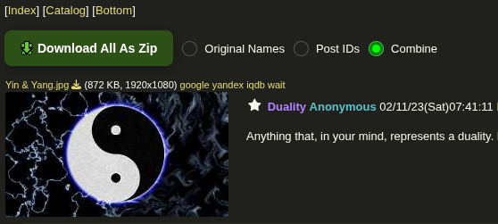

# 4chan-dl

Download media files (.jpg, .jpeg, .webm, ...) from 4chan.org with their posted filenames.
<br>
If the thread has multiple files with the same posted filename the files will be renamed (downloaded with a different name).

## UserScript ([Violent Monkey](https://violentmonkey.github.io/get-it/), ...)

Adds a button that lets you download all the content from a thread in a zip file.

### Preview



### [ Click here to install ](https://github.com/0000xFFFF/4chan-dl/raw/refs/heads/master/4chan-dl.user.js)

#### note: if you're using [4chan-x](https://github.com/ccd0/4chan-x), the script should still work

## Python version

[](http://www.python.org/download/)

### Setup virtual environment & install - before running anything
```sh
./setup-env.sh
./install.sh
```

### Running
```sh
./4chan-dl -d downloads "https://boards.4chan.org/XX/thread/XXXXXXX"
```

### Recommended way to run
Just downloads new files in thread.
```sh
./4chan-dl -g -d downloads "https://boards.4chan.org/XX/thread/XXXXXXX"
```

### Usage
```sh
./4chan-dl -h
```
```
usage: 4chan-dl [-h] [-d directory] [-s] [-r] [-p] [-c] [-f file.txt] [-t num_threads] [-v] [-g] url

Download media files from 4chan.org with their posted filenames

positional arguments:
  url                   4chan thread url

options:
  -h, --help            show this help message and exit
  -d directory, --directory directory
                        directory to save files to
  -s, --skip            if file exists with the same filename skip it (default: overwrite)
  -r, --recursive_skip  recursively search for filenames to skip
  -p, --postid          download files with post's id rather than posted filename
  -c, --combine         download files with post's id + posted name (<postid>_<postname>.<ext>)
  -f file.txt, --filter file.txt
                        urls to ignore stored in file
  -t num_threads, --threads num_threads
                        number of download worker threads (default: 1)
  -v, --verbose         be more verbose
  -g, --goodargs        -crvt 5
```

# Diclaimer
* This project is for educational and personal use only.
* The author is not responsible for how this tool is used.
* Please respect 4chan’s Rules and avoid scraping illegal or prohibited content.

